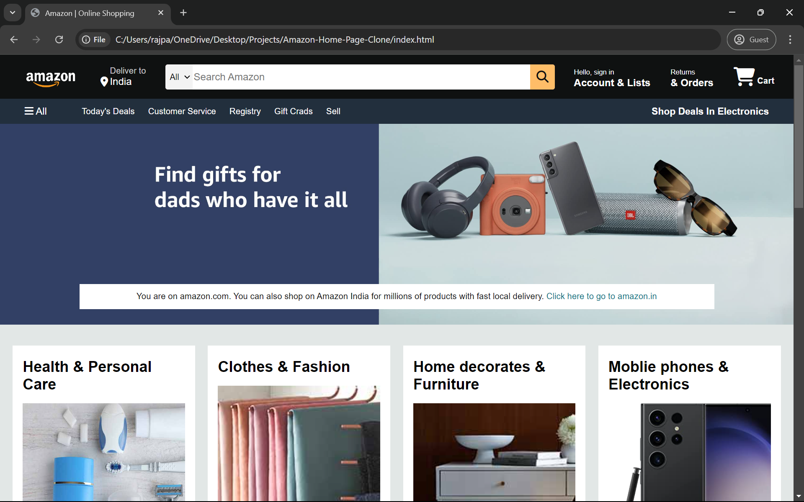
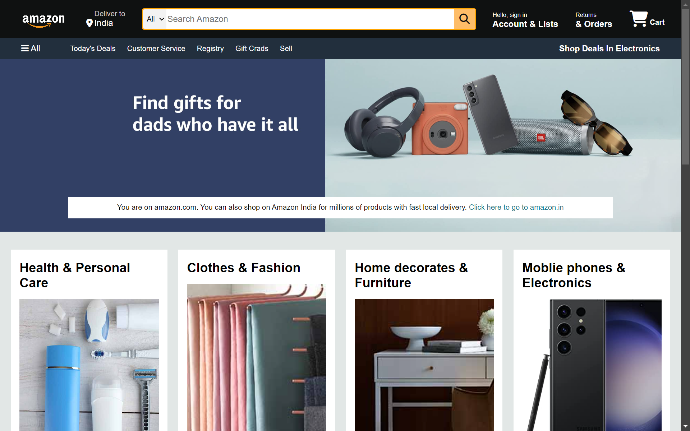
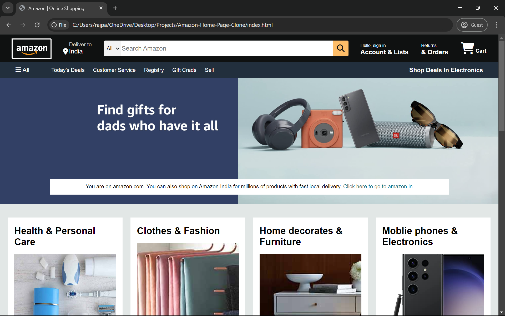
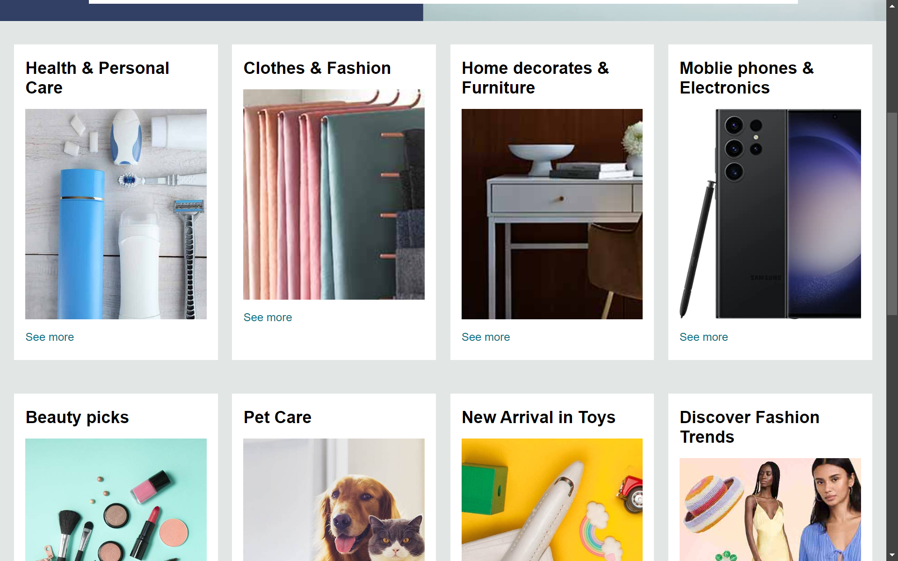
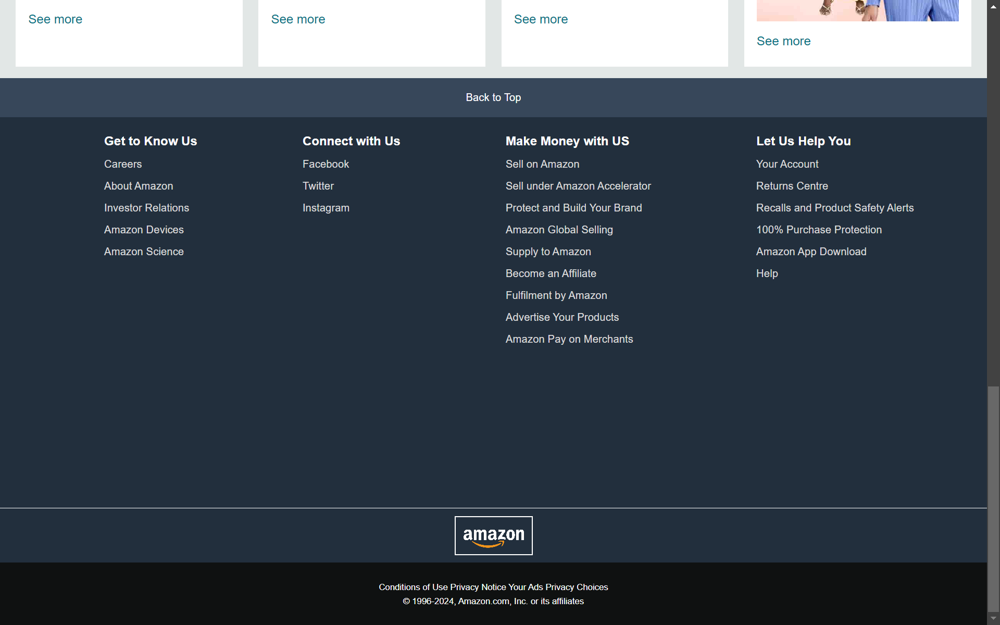

<b>Amazon Homepage Clone</b> 

This project is a clone of the Amazon homepage, created using only HTML and CSS. This project aims to practice front-end web development skills, focusing on layout design, styling, and responsiveness. 

Table of Contents:
1. Project Overview 
2. Features 
3. Technologies Used 
4. Usage 
5. Contributing 
6. License 
7. Acknowledgements 
8. Project Overview 

The Amazon Homepage Clone is a static webpage that mimics the layout and design of the Amazon homepage. This project is intended for educational purposes and to demonstrate proficiency in HTML and CSS. 

Features: 
*Responsive navigation bar 
*Search bar with dropdown categories 
*Featured product sections 
*Footer with multiple columns 
*Technologies Used 
*HTML5 
*CSS3 
*Setup 

Usage: 
*Feel free to use this project as a reference for your own HTML and CSS projects. You can modify the code to add more features or improve the design. 

Contributing: 
*Contributions are welcome! If you have any suggestions or improvements, please create a pull request or open an issue. 

Fork the Project: 
*Create your Feature Branch (git checkout -b feature/AmazingFeature) 
*Commit your changes (git commit -m 'Add some AmazingFeature') 
*Push to the Branch (git push origin feature/AmazingFeature) 
*Open a Pull Request 

Acknowledgements: 
*Amazon for the inspiration 
*Font Awesome for icons 
*Google Fonts for fonts 

<b> Here Are Some Screenshots</b> 
 
Here is a picture of the home page of Amazon
 
  
 
Here is a Picture, where I added the hover selector on the search bar and it had an orange color border occur 
 
  
 
Here is a Picture, where I added the hover selector around the icons on the nav bar, and a transparent border occurred 
 
  
 
Here is a Picture, where I showcase the different categories of boxes based on different varieties of products on it 
 
  
 
Here is a Picture, where I placed the footer tag to display the closing information of the website and added the hover selector on each one of the options on the footer with a transparent border 
 
 
